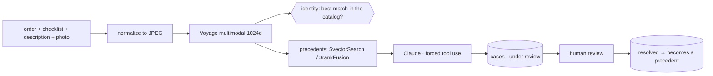

# Multimodal warranty triage

Every retailer that ships physical products receives thousands of warranty claims: a photo, a vague description ("arrived broken"), and an analyst who has to decide whether it is a factory defect, shipping damage, or misuse. Triage is slow, inconsistent between analysts, and everything already resolved stays locked in spreadsheets. Nothing even guarantees that the submitted photo shows the product that was bought.

This PoV triages the claim with multimodal AI, with MongoDB Atlas as the engine behind every layer: Voyage for embeddings, Claude for the verdict, a human for the decision.

The UI is in Brazilian Portuguese (used in customer sessions); the code and this README are in English.

## The demo in four steps

**1. The customer opens a claim.** Order number, symptom checklist, description, photo. Preloaded scenarios (including two where the photo does not match the product) make this one click.


**2. Is this even the right product?** The photo becomes an embedding and is compared against the reference photos of the *entire* catalog. The signal is relative: the ordered product must be the best match among all of them. An absolute threshold alone would let the wrong product through, since studio photos score high against each other anyway.

**3. Precedents, then a structured verdict.** `$vectorSearch` (or hybrid `$rankFusion`) retrieves resolved claims similar to this one, and Claude classifies the probable cause with *forced tool use*: structured output, no fragile parsing of free-text JSON.


The run above is a good example of the model not bluffing: the submitted photo was a catalog image with no visible damage, so the verdict came back **inconclusive with 35% confidence**, saying exactly that and asking for a photo of the real defect.

**4. A human decides.** Every verdict is born `em_analise` (under review); only a person promotes it to `resolvido` (resolved), as Brazilian consumer law requires. Each confirmed claim becomes a precedent for the next ones. The queue updates through a Change Stream, with no polling.




> The screenshots run against a real cluster with a demonstration catalog; the retailer's name was replaced with a neutral one.

## MongoDB behind every layer

| Layer | Where it lives |
|---|---|
| Order lookup | `pedidos` |
| Defect checklist | `catalogo` |
| Claims + verdict + embedding | `chamados` |
| Catalog reference photos | `catalogo_fotos` |
| Semantic search | Vector Search (`defeitos_vector_index`) |
| Hybrid search | `$rankFusion` + Atlas Search (`chamados_text_index`) |
| Live review queue | Change Streams over SSE |
| Analytics | Aggregation Pipeline (ready for Atlas Charts) |
| Schema governance | `$jsonSchema` validators |

Image blobs stay **outside** MongoDB, the correct pattern for blobs. In the PoV they live on local disk (`backend/media/`); in production you reimplement `storage.py` with S3 + CDN and the `(uri, url)` interface does not change.

**Stack:** FastAPI + Motor · Voyage `voyage-multimodal-3.5` (1024d) · Claude with forced tool use through the Grove gateway (`pov-shared`) · React + Vite + LeafyGreen. Everything (database, collections, indexes, models) is parameterized in `.env`; see `.env.example`, and never commit a real `.env`.

## Setup

Requirements: Python 3.12+, Node 22, an Atlas cluster (Vector Search + Atlas Search), a Voyage key and access to the Grove gateway. Copy `.env.example` to `.env` and fill it in (placeholders only in the example; never commit the real `.env`).

```bash
cd backend
python3 -m venv .venv && ./.venv/bin/pip install -r requirements.txt
# Every LLM call goes through the Grove gateway via pov-shared (_shared/grove_client).
# It is not on PyPI: install it from the sibling workspace folder.
uv pip install --python .venv/bin/python -e "../../_shared[llm]"
```

Seed photos: the demo-scenario photos in `frontend/public/demo/` are public catalog images. The seed reads `SEED_IMAGES_DIR` (default `seed_images/`, layout `cad_01.jpg …` and `catalogo/<sku>/1.jpg … N.jpg`) and falls back to the copies a previous seed left in `backend/media/{seed,catalogo}/`. No photos at all? `./.venv/bin/python generate_placeholders.py && ./.venv/bin/python generate_catalogo_placeholders.py`.

### Reset: one command rebuilds all demo data

```bash
# from the repo root. Takes 1-3 min (Voyage embeddings + Atlas index build).
MONGODB_DB=analise_garantia_test backend/.venv/bin/python scripts/reset_demo.py   # *_test databases: free
ALLOW_DEMO_DB_WRITE=1 backend/.venv/bin/python scripts/reset_demo.py              # the demo database
```

It is idempotent and touches only this PoV's collections (`pedidos`, `catalogo`, `chamados`, `catalogo_fotos`, `idempotencia`): orders + checklist, removes cases created during demos (their image files in `backend/media/chamados/` are kept), reseeds the 15 resolved precedents and the catalog reference photos with embeddings, recreates regular/TTL/Vector Search/Atlas Search indexes and `$jsonSchema`, then waits for the search indexes to be `READY` and validates with a real `$vectorSearch`. Every writing script (`seed*.py`, `setup_indexes.py`, `reset_demo.py`) refuses any database whose name does not end in `_test` unless `ALLOW_DEMO_DB_WRITE=1`.

## Run

```bash
./start.sh                                  # backend 127.0.0.1:8100 + frontend :5190
cd backend && ./.venv/bin/python test_http.py   # full-pipeline smoke test against the running backend
```

By default the launcher serves the optimized frontend build without a watcher. For HMR editing run `POV_DEV=1 ./start.sh`; the build is only redone when sources or configuration change.

## Tests

```bash
cd backend
./.venv/bin/pip install -r requirements-dev.txt
./.venv/bin/pytest -q        # unit + adversarial suite, no Atlas or network (gateway mocked)
./.venv/bin/ruff check . ../scripts
cd ../frontend && node --test tests/*.test.mjs

# live adversarial suite: real Atlas + Voyage + Grove, only against a *_test database
LIVE_API_URL=http://127.0.0.1:8100 backend/.venv/bin/pytest -q backend/tests/adversarial/test_live_adversarial.py
```

`backend/tests/adversarial/` covers hostile uploads (text/SVG/PDF/GIF/WebP disguised as JPEG, decompression bombs, truncated files, EXIF with GPS, traversal in names and checklist ids), NoSQL operator injection, prompt injection in the report and written inside the photo, dilution of the injection signal in a long report, PII in prompts/traces, Grove timeout/429/5xx/slow gateway, Langfuse down, parallel identical submissions and concurrent reviews. In the public CI the tests that need the private `pov-shared` package are skipped.

Docker: `docker build --build-context shared=../_shared -t warranty-triage . && docker run --env-file .env -p 18081:8080 warranty-triage`.

## Resilience and observability (on by default)

- **LLM:** `_shared/grove_client.AsyncGroveClient` (Bearer + real key in `x-api-key`), retries with jitter on 429/5xx/timeouts, circuit breaker and optional model fallback, plus a total deadline (`LLM_DEADLINE_SECONDS`, 90 s). If the gateway still fails, the case is kept with an `inconclusivo` manual-review verdict instead of an error. There is no direct-provider fallback.
- **Voyage:** 30 s timeout, 3 attempts with exponential backoff, total deadline per embedding.
- **MongoDB:** server-selection/connect/socket timeouts, retryable reads and writes, `maxTimeMS` on reads; every driver error becomes a readable `{error: {kind, message}}` (input errors 4xx, infrastructure 503).
- **Prompt safety:** the customer report and precedents are sent as delimited data with PII masked; an offline heuristic scores the report as a whole and per clause (no dilution); the model flags instructions it sees in the report or written in the photo. On any alert the confidence is capped at 50% and the reviewer sees why.
- **Langfuse** (optional): set `LANGFUSE_PUBLIC_KEY`/`LANGFUSE_SECRET_KEY`/`LANGFUSE_HOST`. Fail-open, one trace per analysis created after PII masking, no image bytes or vectors.

## Why one document per case (measured)

Metadata, the 1024-float vector, the identity check, the verdict and the photo reference live in a single `chamados` document, written with one insert plus one update. The portal shows the document size and the real insert/update time of every analysis.

`scripts/bench_documento_unico.py` is a data-modeling comparison inside MongoDB, not a competitive benchmark: it writes and reads the same case as one document and as three collections (metadata, vector, verdict) on the same cluster, with the same driver, to show the round-trip cost of splitting the case and the extra cost of making the split atomic with a multi-document transaction. It does not measure any other database and is not a floor or ceiling for other architectures.

```bash
MONGODB_DB=<db>_test backend/.venv/bin/python scripts/bench_documento_unico.py 30
```

Measured on 2026-10-09, N=30, demo cluster from a laptop (results depend on schema, cluster and network):

| Model | Operation | p50 | p95 |
|---|---|---|---|
| One document | write, 1 op | 386.8 ms | 391.6 ms |
| One document | read, 1 op | 379.2 ms | 385.6 ms |
| Three collections | write, 3 ops (not atomic) | 854.6 ms | 893.7 ms |
| Three collections | write, 3 ops in a transaction | 1075.1 ms | 1097.6 ms |
| Three collections | read, 3 ops | 701.8 ms | 733.3 ms |

## Endpoints

| Method | Route | What |
|---|---|---|
| POST | `/api/lookup` | order → products |
| GET | `/api/checklist/{categoria}` | checklist items |
| POST | `/api/analisar` | full pipeline; `modo=vector` or `hybrid` |
| GET | `/api/chamados/pendentes` | review queue |
| POST | `/api/revisar` | human review → resolved |
| GET | `/api/analytics` | aggregations |
| GET | `/api/chamados/stream` | Change Stream (SSE) |
| GET | `/api/health` · `/api/metrics` | ping + counts · latency, tokens |

## Production boundary

Uploads are limited by bytes, pixel count, number of images, and description length; the real file format (not the declared MIME type) must be JPEG or PNG, EXIF metadata is stripped, the uploaded file name is never used, and checklist IDs and storage paths go through an allowlist. The image runs as UID 10001 behind an nginx configuration with security headers. Authentication is intentionally outside this PoV: expose it only behind an IdP/API gateway with TLS, request quotas, and object storage in place of the local media directory.

## License

MIT, see [LICENSE](LICENSE).
