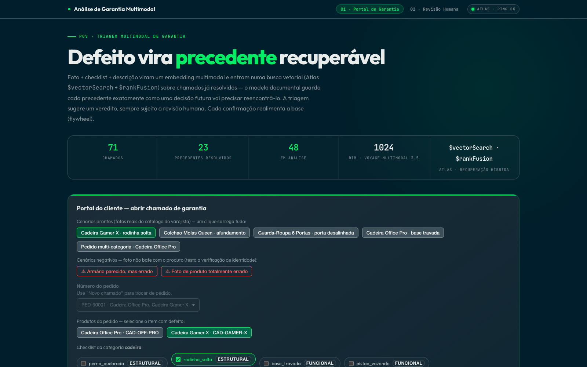
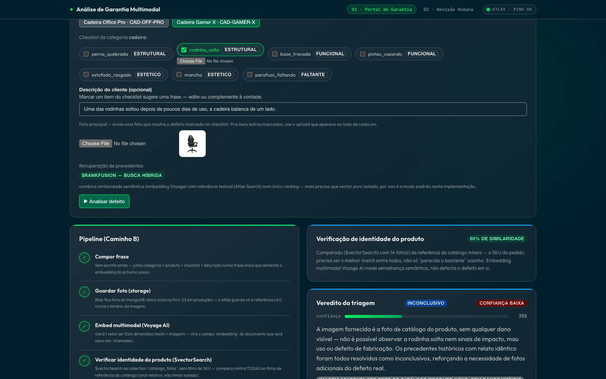
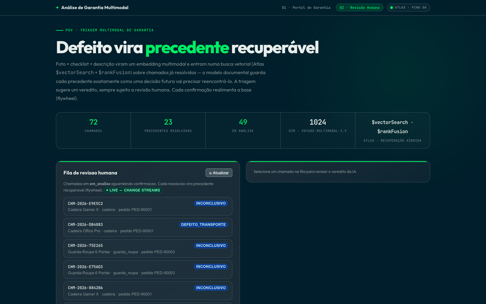
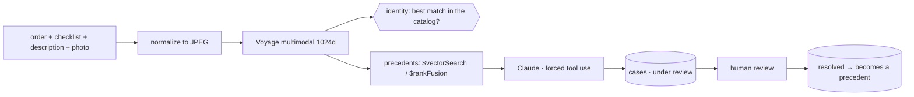

# Multimodal warranty triage

Every retailer that ships physical products receives thousands of warranty claims: a photo, a vague description ("arrived broken"), and an analyst who has to decide whether it is a factory defect, shipping damage, or misuse. Triage is slow, inconsistent between analysts, and everything already resolved stays locked in spreadsheets. Nothing even guarantees that the submitted photo shows the product that was bought.

This PoV triages the claim with multimodal AI, with MongoDB Atlas as the engine behind every layer: Voyage for embeddings, Claude for the verdict, a human for the decision.

The UI is in Brazilian Portuguese (used in customer sessions); the code and this README are in English.

## The demo in four steps

**1. The customer opens a claim.** Order number, symptom checklist, description, photo. Preloaded scenarios (including two where the photo does not match the product) make this one click.



**2. Is this even the right product?** The photo becomes an embedding and is compared against the reference photos of the *entire* catalog. The signal is relative: the ordered product must be the best match among all of them. An absolute threshold alone would let the wrong product through, since studio photos score high against each other anyway.

**3. Precedents, then a structured verdict.** `$vectorSearch` (or hybrid `$rankFusion`) retrieves resolved claims similar to this one, and Claude classifies the probable cause with *forced tool use*: structured output, no fragile parsing of free-text JSON.



The run above is a good example of the model not bluffing: the submitted photo was a catalog image with no visible damage, so the verdict came back **inconclusive with 35% confidence**, saying exactly that and asking for a photo of the real defect.

**4. A human decides.** Every verdict is born `em_analise` (under review); only a person promotes it to `resolvido` (resolved), as Brazilian consumer law requires. Each confirmed claim becomes a precedent for the next ones. The queue updates through a Change Stream, with no polling.





> The screenshots run against a real cluster with a demonstration catalog; the retailer's name was replaced with a neutral one.

## MongoDB behind every layer

| Layer | Where it lives |
|---|---|
| Order lookup | `pedidos` |
| Defect checklist | `catalogo` |
| Claims + verdict + embedding | `chamados` |
| Catalog reference photos | `catalogo_fotos` |
| Semantic search | Vector Search (`defeitos_vector_index`) |
| Hybrid search | `$rankFusion` + Atlas Search (`chamados_text_index`) |
| Live review queue | Change Streams over SSE |
| Analytics | Aggregation Pipeline (ready for Atlas Charts) |
| Schema governance | `$jsonSchema` validators |

Image blobs stay **outside** MongoDB, the correct pattern for blobs. In the PoV they live on local disk (`backend/media/`); in production you reimplement `storage.py` with S3 + CDN and the `(uri, url)` interface does not change.

**Stack:** FastAPI + Motor · Voyage `voyage-multimodal-3.5` (1024d) · Claude with forced tool use · React + Vite + LeafyGreen. Everything (database, collections, indexes, models) is parameterized in `.env`; see `.env.example`, and never commit a real `.env`.

## Setup

The demo-scenario photos shipped in `frontend/public/demo/` are public catalog images. To seed the backend with your own catalog instead of generic "damaged product" images, point `SEED_IMAGES_DIR` at your photos.

```bash
cd backend
python3 -m venv .venv && ./.venv/bin/pip install -r requirements.txt
export SEED_IMAGES_DIR=/path/to/your/photos     # or set it in .env

# expected layout: cad_01.jpg … and catalogo/<sku>/1.jpg … N.jpg
./.venv/bin/python seed_meta.py             # orders + checklist
./.venv/bin/python seed.py                  # 15 resolved claims (generates image embeddings)
./.venv/bin/python seed_catalogo_fotos.py   # reference photos per SKU
./.venv/bin/python setup_indexes.py         # indexes + $jsonSchema

# no photos yet? synthetic placeholders:
./.venv/bin/python generate_placeholders.py
./.venv/bin/python generate_catalogo_placeholders.py
```

## Run

```bash
./start.sh                                  # backend :8100 + frontend :5190
cd backend && ./.venv/bin/python test_http.py   # full-pipeline smoke test
```

By default the launcher serves the optimized frontend build without a watcher. For HMR editing run `POV_DEV=1 ./start.sh`; the build is only redone when sources or configuration change.

```bash
cd backend
./.venv/bin/pip install -r requirements-dev.txt
./.venv/bin/pytest        # unit tests, no Atlas or network
./.venv/bin/ruff check .
```

Docker: `docker build -t warranty-triage . && docker run --env-file .env -p 18081:8080 warranty-triage`.

## Endpoints

| Method | Route | What |
|---|---|---|
| POST | `/api/lookup` | order → products |
| GET | `/api/checklist/{categoria}` | checklist items |
| POST | `/api/analisar` | full pipeline; `modo=vector` or `hybrid` |
| GET | `/api/chamados/pendentes` | review queue |
| POST | `/api/revisar` | human review → resolved |
| GET | `/api/analytics` | aggregations |
| GET | `/api/chamados/stream` | Change Stream (SSE) |
| GET | `/api/health` · `/api/metrics` | ping + counts · latency, tokens |

## Production boundary

Uploads are limited by bytes, pixel count, number of images, and description length; checklist IDs and storage paths go through an allowlist. The image runs as UID 10001 behind an nginx configuration with security headers. Authentication is intentionally outside this PoV: expose it only behind an IdP/API gateway with TLS, request quotas, and object storage in place of the local media directory.

## License

MIT, see [LICENSE](LICENSE).
